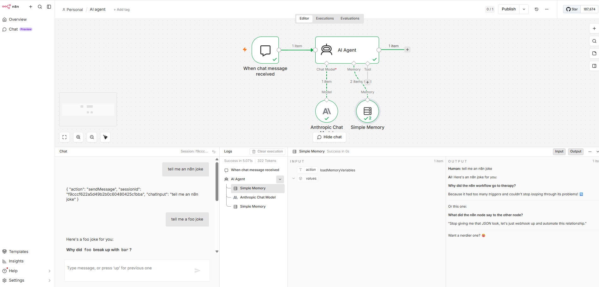
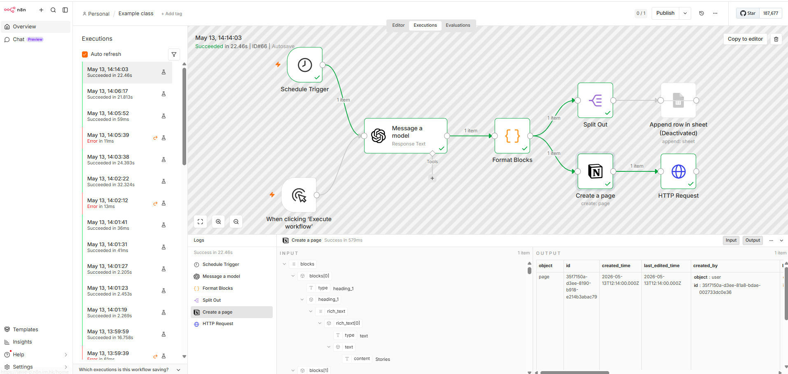
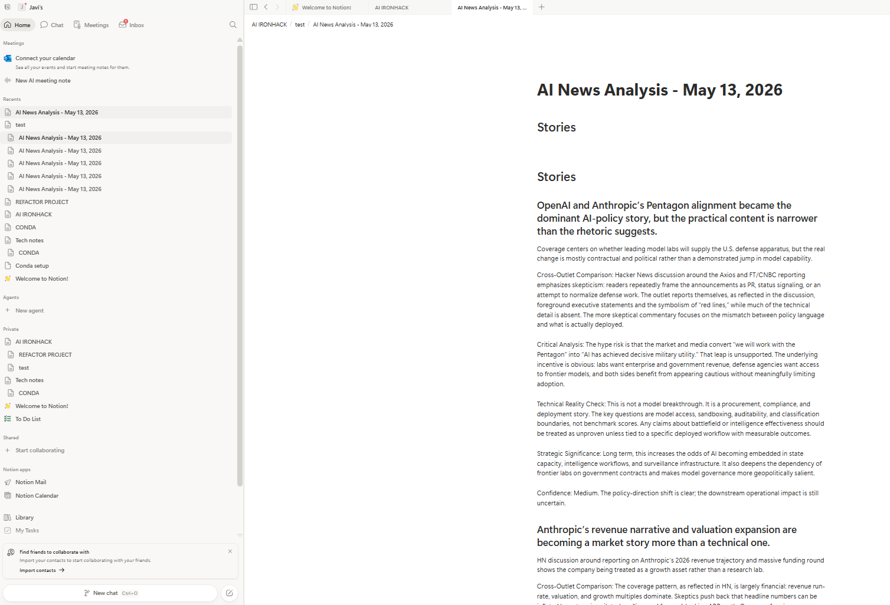

# n8n Node Study Guide Lab

This repository contains the n8n Node Study Guide Lab deliverables.

## Files

- `node_reference_table.md`: Main reference table documenting analyzed n8n nodes.
- `lab_summary.md`: Required short summary paragraph.
- `examples/`: Representative input and output JSON examples from the analyzed workflows.
- `screenshots/`: Screenshots available for the analyzed workflows.
- `workflows/`: Exported n8n workflow JSON files.
- `notes/`: Notes about scope and missing screenshot evidence.

## Workflows analyzed

1. `AI agent`
   - Chat Trigger
   - AI Agent
   - Anthropic Chat Model
   - Simple Memory

2. `Example class`
   - Schedule Trigger
   - Manual Trigger
   - Message a model
   - Code / Format Blocks
   - Split Out
   - Notion Create Page
   - HTTP Request
   - Append row in sheet node present but disabled in the exported workflow

## Screenshots
Trello board showing both demo cards:

n8n screenshot showing Agentic flow overview:

Notion screenshot showing result of news inserted in a page:

## Privacy and credentials
Credential names may appear in exported workflow JSON because n8n includes credential references. Secret values, API keys, and tokens are not included in the example JSON files.
